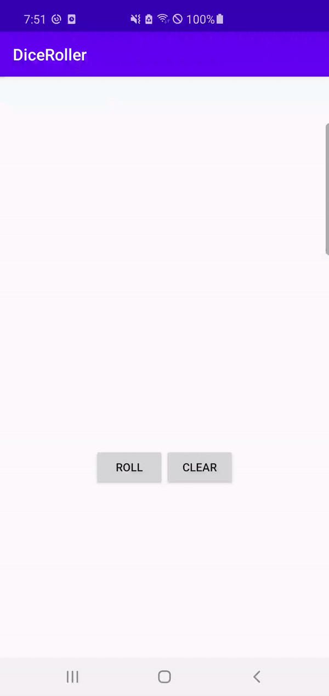

# Homework

## **Change an app**

Add a **Clear** button to the DiceRoller app that sets the dice image back to the empty image.

> Result video

## **Answer these questions**

### **Question 1**

Which `<ImageView>` attribute indicates a source image that should be used only in Android Studio?

- `android:srcCompat`
- `app:src`
- `tools:src`
- `tools:sourceImage`

### Answer 1

- `tools:src`

 

### **Question 2**

Which method changes the image resource for an `ImageView` in Kotlin code?

- `setImageResource()`
- `setImageURI()`
- `setImage()`
- `setImageRes()`

### Answer 2

- `setImageResource()`

 

### **Question 3**

What does the `lateinit` keyword in a variable declaration indicate in Kotlin code?

- The variable is never initialized.
- The variable is only initialized at app runtime.
- The variable is automatically initialized to `null`.
- The variable will be initialized later. I promise!

### Answer 3

- `The variable is only initialized at app runtime.`

 

### **Question 4**

Which Gradle configuration indicates the most recent API level your app has been tested with?

- `minSdkVersion`
- `compileSdkVersion`
- `targetSdkVersion`
- `testSdkVersion`

### Answer 4

- `compileSdkVersion`

 

### **Question 5**

You see an import line in your code that starts with `androidx`. What does this mean?

- The class is part of the Android Jetpack libraries.
- The class is in an external library that will be dynamically loaded when the app runs.
- The class is "extra" and optional to your class.
- The class is part of Android's XML support.

### Answer 5

- The class is part of the Android Jetpack libraries.

---